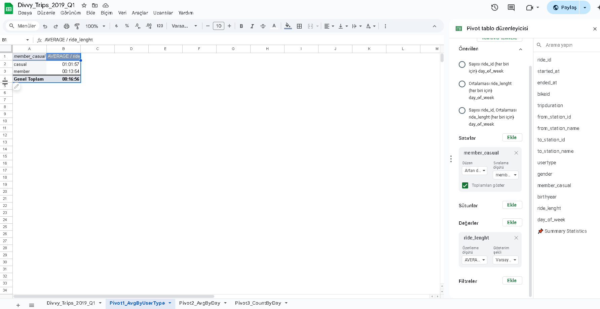
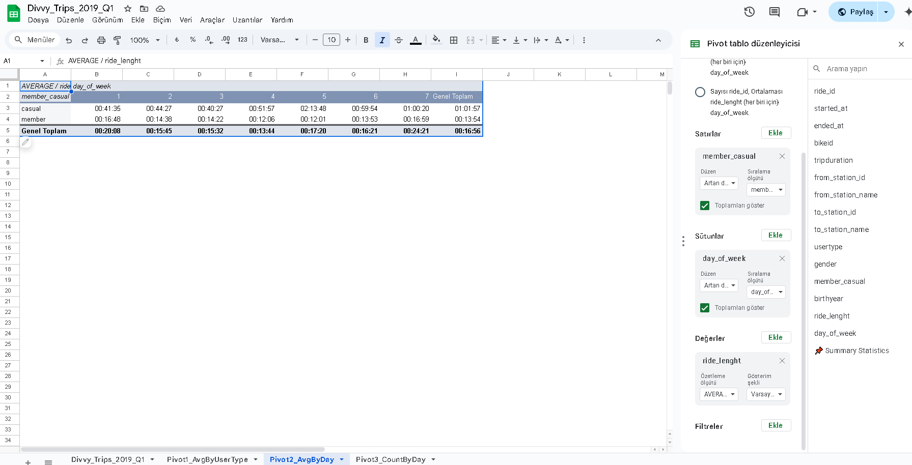
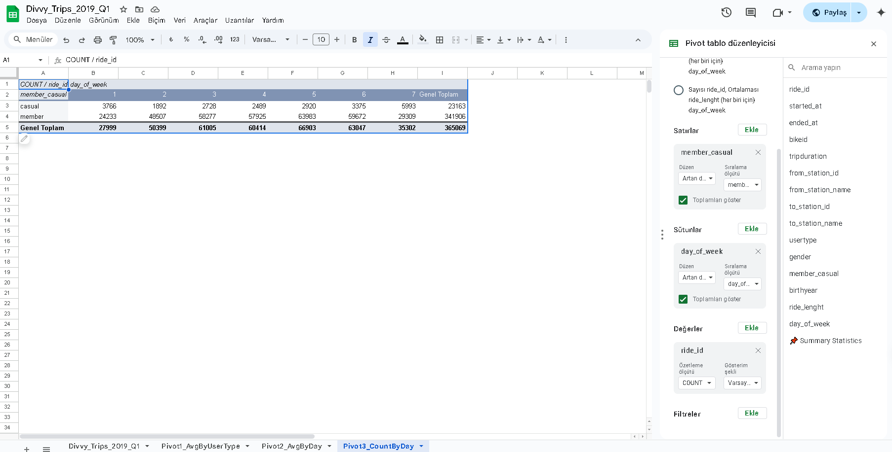
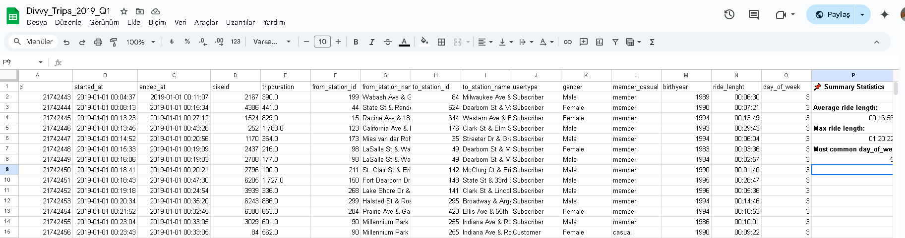
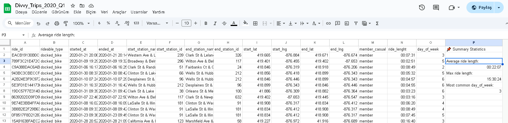

# 📊 Analyze Phase – Pivot Table Summary (Google Sheets)

This document summarizes the descriptive analysis conducted in the **Analyze** phase using **Google Sheets**, focusing on key comparisons between annual members and casual riders.

---

## 1. 📈 Average Ride Length by User Type  
**📸 Screenshot:**  


**Pivot Table Setup:**
- **Rows:** `member_casual`
- **Values:** `ride_length` (Summarized by **AVERAGE**)

**Insights:**
- Casual users: ~1 hour average ride duration  
- Members: ~14 minutes average ride duration  

This suggests that casual riders take fewer but longer leisure rides, while members likely use bikes more frequently for short commutes.

---

## 2. 📅 Average Ride Length by Day and User Type  
**📸 Screenshot:**  


**Pivot Table Setup:**
- **Rows:** `member_casual`
- **Columns:** `day_of_week`
- **Values:** `ride_length` (Summarized by **AVERAGE**)

**Insights:**
- Casual users ride more on **weekends** with longer durations.  
- Members ride more consistently during **weekdays**, with shorter trips.

---

## 3. 🔢 Ride Count by Day and User Type  
**📸 Screenshot:**  


**Pivot Table Setup:**
- **Rows:** `member_casual`
- **Columns:** `day_of_week`
- **Values:** `ride_id` (Summarized by **COUNT**)

**Insights:**
- Members show high ride counts during weekdays (likely commuters).  
- Casual users are more active on weekends.

---

## 4. 📊 Quick Summary Stats (2019 vs 2020)  
**📸 Screenshots:**  
-   
- 

These spreadsheet sections include basic calculations for each trip:
- **ride_length:** Time difference between `ended_at` and `started_at`
- **day_of_week:** Numeric value using `WEEKDAY()` formula

**Metrics visible in side panels:**
- Average ride length  
- Max ride length  
- Most common day of the week for rides  

**Key Formulas Used:**
```excel
ride_length = ended_at - started_at
day_of_week = WEEKDAY(started_at, 1)
