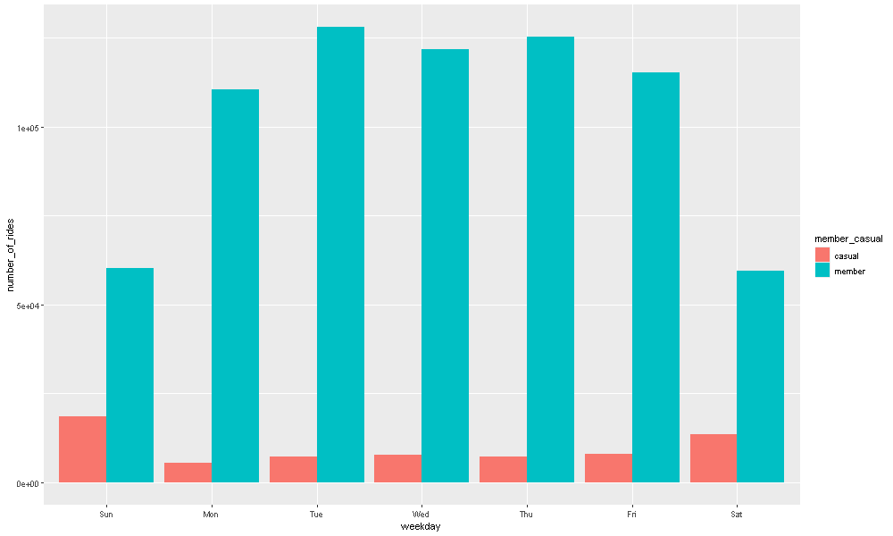
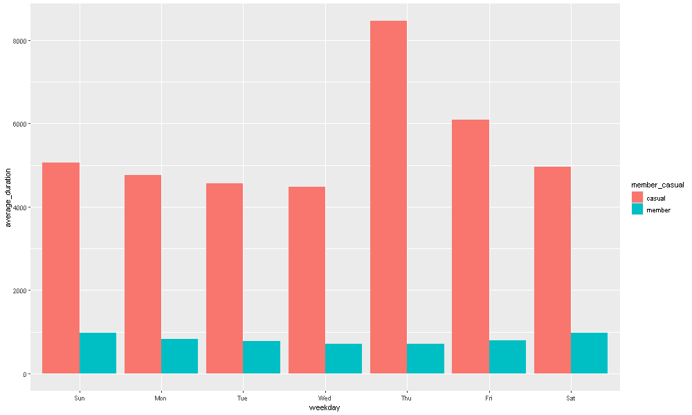

# 📊 Cyclistic R Analysis – Data Wrangling, Descriptive Analysis & Visualization

This document presents a comprehensive R-based analysis of Cyclistic’s Q1 2019 and Q1 2020 bike trip data. The goal is to explore how **casual riders** and **annual members** use Cyclistic bikes differently, and to generate insights that support business decisions for increasing membership.

> **Business Question:**  
> How do annual members and casual riders use Cyclistic bikes differently?

---

## 🔄 Analysis Framework

This analysis follows the 5-step structure outlined in the [Google Data Analytics Capstone Case Study](https://www.coursera.org/learn/google-data-analytics-capstone), using `tidyverse`, `lubridate`, and `ggplot2` in R:

| Step | Description |
|------|-------------|
| 1    | Import and inspect raw data |
| 2    | Clean, rename, and combine datasets |
| 3    | Prepare additional fields |
| 4    | Perform descriptive analysis |
| 5    | Visualize and export results |

---

## 📁 Files Used

- `Divvy_Trips_2019_Q1.csv`
- `Divvy_Trips_2020_Q1.csv`
- `avg_ride_length.csv`
- `avg_ride_duration_by_weekday.png`
- `rides_by_weekday.png`

---

## 📦 STEP 1 – Import Data

```
library(tidyverse)
library(lubridate)
library(conflicted)

conflict_prefer("filter", "dplyr")
conflict_prefer("lag", "dplyr")

# Read CSV files
q1_2019 <- read_csv("Divvy_Trips_2019_Q1.csv")
q1_2020 <- read_csv("Divvy_Trips_2020_Q1.csv")
```

## 🔄 STEP 2 – Wrangle and Combine Data

Before combining the datasets, we ensured that their column names and formats were consistent. The 2019 dataset had different column names, so we renamed them to match the 2020 structure. Then, we combined the two datasets using `bind_rows()`.

---

```r
# Rename columns in the 2019 dataset to match the 2020 format
q1_2019 <- rename(q1_2019,
  ride_id = trip_id,                     # Standardize ride ID column
  rideable_type = bikeid,               # Rename bike type
  started_at = start_time,              # Rename start time
  ended_at = end_time,                  # Rename end time
  start_station_name = from_station_name,   # Rename start station name
  start_station_id = from_station_id,       # Rename start station ID
  end_station_name = to_station_name,       # Rename end station name
  end_station_id = to_station_id,           # Rename end station ID
  member_casual = usertype              # Rename user type to match new label
)
```
## 🧹 STEP 3 – Clean Data

At this stage, we made the dataset consistent and ready for analysis by:

- Standardizing labels in the `member_casual` column  
- Calculating `ride_length` for each trip  
- Filtering out invalid or system-generated rides  
- Creating additional time-based fields (e.g., day, month, weekday)

---

```
# Check current values in member_casual column
table(all_trips$member_casual)  # Outputs counts of 'Subscriber', 'Customer', etc.
```
```
# Recode old user type labels to match 2020 format
all_trips <- all_trips %>%
  mutate(member_casual = recode(member_casual,
    "Subscriber" = "member",   # Normalize to "member"
    "Customer" = "casual"      # Normalize to "casual"
  ))
```

```
# Check again to verify the recoding was successful
table(all_trips$member_casual)
```

### 🗓️ Add Time-Based Columns

To make temporal analysis easier, we extracted several date components from the `started_at` timestamp. This enables grouping and summarizing by **month**, **day**, **year**, and **day of the week**.

```
all_trips$date <- as.Date(all_trips$started_at)         # Extract only the date part (YYYY-MM-DD)
all_trips$month <- format(all_trips$date, "%m")         # Extract month as two-digit number (01–12)
all_trips$day <- format(all_trips$date, "%d")           # Extract day of the month
all_trips$year <- format(all_trips$date, "%Y")          # Extract year (e.g., 2019, 2020)
all_trips$day_of_week <- format(all_trips$date, "%A")   # Extract weekday name (e.g., Monday, Friday)
```

### ⏱️ Calculate Ride Duration
Since the 2020 dataset no longer included a **tripduration** field, we calculated the ride duration manually using the **started_at** and **ended_at** timestamps. The duration is calculated in seconds.

```
all_trips$ride_length <- difftime(all_trips$ended_at, all_trips$started_at)  # Result is a difftime object
```

Check the structure of the column to ensure it's not a factor:
```
str(all_trips$ride_length)  # Should return 'difftime' or 'factor'
```
Convert to numeric to allow for arithmetic operations (e.g., mean, max, min):
```
all_trips$ride_length <- as.numeric(as.character(all_trips$ride_length))  # Convert to seconds
```
Verify that conversion was successful:
```
is.numeric(all_trips$ride_length)  # Should return TRUE
```

###🚫 Remove Invalid Entries
Some rows contain test rides (e.g., internal system checks from station "HQ QR") or rides with negative durations due to errors. These would bias the analysis and should be removed.

We created a cleaned version of the dataset called all_trips_v2:
```
all_trips_v2 <- all_trips %>%
  filter(start_station_name != "HQ QR" & ride_length >= 0)  # Keep only valid rows
```

## 📊 STEP 4 – Descriptive Analysis

In this step, we analyzed ride behaviors by computing basic summary statistics such as:

- Overall average, median, max, and min ride durations
- Average ride duration by membership type
- Average ride duration by membership type and day of the week

All analyses are based on the cleaned dataset: `all_trips_v2`.

---

### 📈 1. Overall Ride Length Summary

The `summary()` function gives a quick overview of ride duration values in seconds.

```
summary(all_trips_v2$ride_length)
```
🔎 This includes minimum, 1st quartile, median, mean, 3rd quartile, and maximum.

### 2. Compare Member vs. Casual Riders

We compared ride durations between **member** and **casual** users using the `aggregate()` function to generate key summary statistics: **mean**, **median**, **maximum**, and **minimum** ride durations.

This helps us understand **which user type rides longer** on average, and which has more extreme values.

---

#### ➕ Mean Ride Length by User Type

```r
aggregate(ride_length ~ member_casual, data = all_trips_v2, FUN = mean)
```
📌 Calculates the average (mean) ride duration for each user type.

#### ➕ Median Ride Length by User Type
```
aggregate(ride_length ~ member_casual, data = all_trips_v2, FUN = median)
```
📌 Finds the median ride duration — the midpoint that splits rides into shorter and longer halves.

#### ➕ Maximum Ride Length by User Type
```
aggregate(ride_length ~ member_casual, data = all_trips_v2, FUN = max)
```
📌 Identifies the longest recorded ride for each user type.

#### ➕ Minimum Ride Length by User Type
```
aggregate(ride_length ~ member_casual, data = all_trips_v2, FUN = min)
```
📌 Finds the shortest recorded ride — useful to detect possible anomalies (e.g., zero-length rides).

#### 💡 Insight:
These comparisons show how ride patterns differ between the two user groups. Typically, casual users tend to take longer rides (often for leisure), while members take shorter, more frequent rides (often for commuting).

## 📈 STEP 5 – Visualize Data

In this step, we used `ggplot2` from the **tidyverse** package to visualize ride patterns across different weekdays for both casual riders and members.

Two key charts were created:
1. Number of rides by user type and weekday
2. Average ride duration by user type and weekday

These charts help **communicate behavioral differences clearly** and support data-driven decision-making.

---

#### 📊 1. Number of Rides by Weekday and User Type

```r
all_trips_v2 %>%
  mutate(weekday = wday(started_at, label = TRUE)) %>%  # Extract weekday as a label (e.g., Mon, Tue)
  group_by(member_casual, weekday) %>%                  # Group by user type and weekday
  summarise(number_of_rides = n()) %>%                  # Count rides in each group
  ggplot(aes(x = weekday, y = number_of_rides, fill = member_casual)) + 
  geom_col(position = "dodge") +                        # Side-by-side bars
  labs(title = "Number of Rides by Weekday",
       x = "Day of the Week",
       y = "Number of Rides",
       fill = "User Type") +
  theme_minimal()
```

  
📝 *Bar chart showing the number of rides per day, separated by user type (casual vs. member).*


#### 📊 2. Average Ride Duration by Weekday and User Type
```
all_trips_v2 %>%
  mutate(weekday = wday(started_at, label = TRUE)) %>%
  group_by(member_casual, weekday) %>%
  summarise(average_duration = mean(ride_length)) %>%
  ggplot(aes(x = weekday, y = average_duration, fill = member_casual)) + 
  geom_col(position = "dodge") +
  labs(title = "Average Ride Duration by Weekday",
       x = "Day of the Week",
       y = "Avg Duration (seconds)",
       fill = "User Type") +
  theme_minimal()
```
  
📝 *Bar chart displaying average ride duration (in seconds) for each day of the week, comparing members and casual riders.*

## 📤 STEP 6 – Export Output

After completing the data wrangling, cleaning, analysis, and visualization steps, we exported the final aggregated results to a `.csv` file for further reporting, sharing, or use in tools like Excel, Google Sheets, or Tableau.

The exported file includes:
- Average ride duration by weekday
- Grouped by `member_casual` (user type)

---

### 💾 Export Average Ride Length by Weekday

We use `write.csv()` to save the result to the `outputs/` folder:

```r
# First, create a summary dataset
data_summary <- all_trips_v2 %>%
  mutate(weekday = wday(started_at, label = TRUE)) %>%       # Extract weekday
  group_by(member_casual, weekday) %>%                        # Group by user type and weekday
  summarise(average_duration = mean(ride_length))             # Calculate mean duration

# Export the summary as a CSV file
write.csv(data_summary, "outputs/avg_ride_length.csv", row.names = FALSE)
```

📄 CSV Export:
📥 avg_ride_length.csv

📝 This file can now be used for dashboarding, presentation, or data storytelling in external tools.
