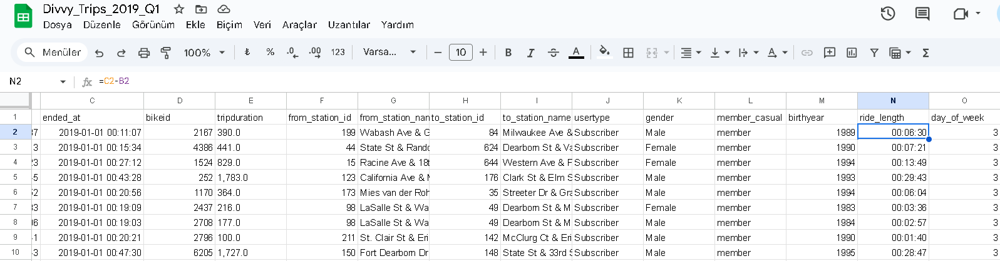
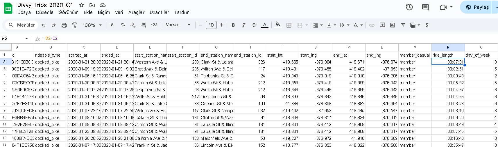
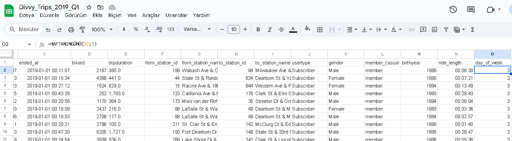
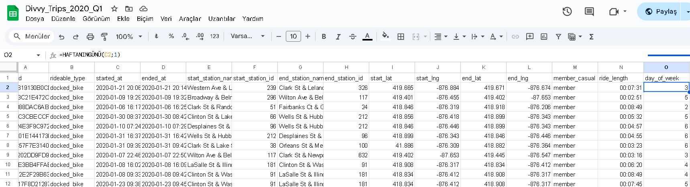

#  Data Cleaning – Google Sheets

##  Tool Used
- Data cleaning and transformation were performed using **Google Sheets**.

##  Cleaning Steps

1. **Calculated `ride_length`:**
   - Computed using the formula `=ended_at - started_at`.
   - Formatted as `HH:MM:SS` to represent trip duration.
   -  
       
     

2. **Created `day_of_week` column:**
   - Used the formula `=WEEKDAY(started_at, 1)` to identify the weekday of each ride.
   - Format: 1 = Sunday, 7 = Saturday.
   -  
       
     

3. **Identified and removed missing data:**
   - Rows with blank or null `started_at` or `ended_at` values were filtered out.
   - Records with logically incorrect durations (e.g., negative ride length) were also excluded if encountered.

## 🔍 Why Google Sheets?
- Google Sheets was ideal for quick inspection, creating pivot summaries, and enabling visual validation during the early stages of exploration.

